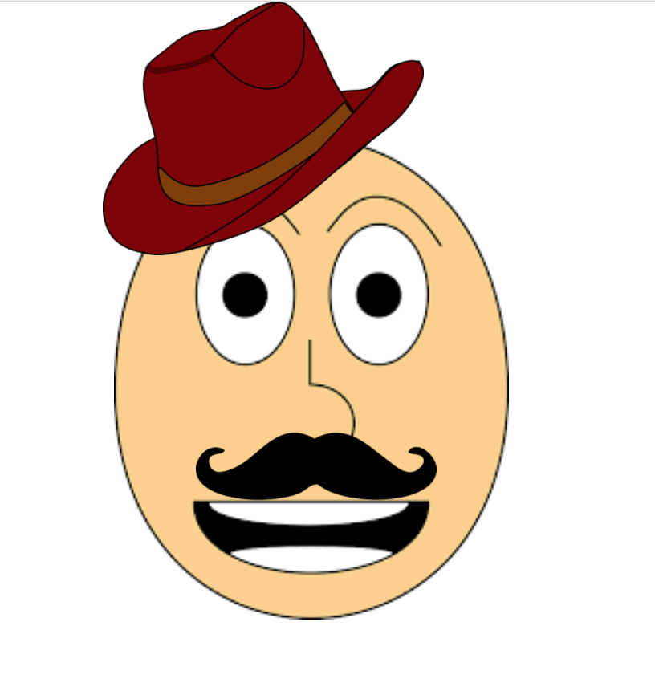

# FACE IT! POSITIONING WITH CSS

##### Setup
- Click the green "Clone or Download" button on this page, and then click "Download Zip".
- Now we're going to unzip the zipped file into the `coding` folder we made earlier. Your zipped file was probably downloaded into your `Downloads` folder, so `cd` into the directory where the zipped file is located.  
- Now we're going to unzip it into our coding folder. On a Mac, to unzip a file from the terminal, run `unzip NashWD1F-master.zip -d path_to_coding folder`. So for me the command was `unzip NashWD1F-master.zip -d ~/Desktop/coding/NashWD1F` 
- Open the `NashWD1F` folder in sublime
- Use the command line to add an `index.html` file and a `style.css` file

## Inside of `index.html`
- Run the `html tab` command to insert our base HTML code. 
- Use a `<link>` tag to link the style in your `style.css` to your html
- Add the three images from the images folder to your html using 3 separate `` tags (hat, face, & moustache).

## Inside `style.css` 
- Use the `position` property along with `top`, `left`, `right`, `bottom` to move the images on the page. Here's a good resource: https://www.w3schools.com/css/css_positioning.asp
- Make the face look somewhat like this:

